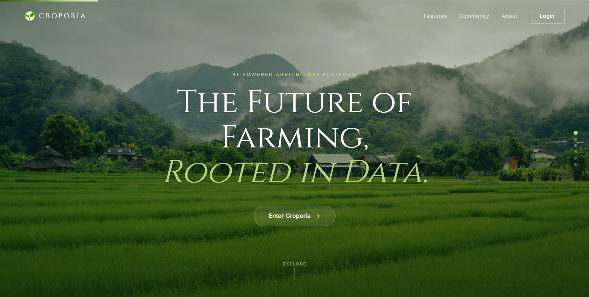

<div align="center">



<br/><br/>


# Croporia

### The Smart Farming Platform Built for India's Next Generation of Farmers

[](https://react.dev)
[](https://fastapi.tiangolo.com)
[](https://mongodb.com)
[](https://groq.com)
[](https://tailwindcss.com)

</div>

---

Croporia is a full-stack farming intelligence platform that puts AI, market data, expert knowledge, and field management into one seamless experience — purpose-built for Indian farmers.

From diagnosing a diseased leaf with a photo to forecasting whether to hold or sell your harvest, Croporia handles the complexity so farmers can focus on what matters: growing.

---

## What It Does

**Crop Wiki** — 43+ detailed Indian crop profiles covering soil type, season, climate, germination timelines, harvest windows, estimated per-acre expenses, cultivation steps, labour needs, and critical watchouts.

**My Farm** — Register and manage your fields. Track soil data, crop plans, and field history in one place.

**AI Farm Assistant** — A RAG-powered chatbot built on LangChain + Groq (LLaMA 3.3 70B) with a FAISS vector store over a curated Indian farming knowledge base. Ask anything, get grounded answers.

**Pest & Disease Scanner** — Upload a leaf photo. The Plant.id API identifies the disease, severity, and treatment recommendations instantly.

**Crop Yield Predictor** — Input your field parameters and get AI-powered yield and revenue forecasts before you sow.

**Climate Simulator** — Simulate rainfall, temperature, and humidity scenarios and see how they impact your chosen crop.

**Crop Monetizer** — Hold-or-sell intelligence. Forecasts price movement over 14 days so you know exactly when to take your harvest to market.

**Farming Practices** — Guides on traditional, tech-driven, and organic farming methods with actionable steps.

**Smart Learning** — 5 structured courses with lessons, insights, and quizzes to level up farming knowledge.

**Talk to Experts** — Browse certified agronomists, view their profiles, and send direct messages.

**Community** — Post updates, reply to threads, bookmark posts, and ask experts questions in a farmer-first feed.

**Crop Market** — A peer-to-peer marketplace to buy and sell crops directly with nearby farmers.

**Curated Feed** — Personalised daily feed with mandi prices, weather, govt schemes, agri news, irrigation advisories, and demand insights.

---

## Tech Stack

| Layer | Technology |
|---|---|
| Frontend | React 19, Vite, Tailwind CSS v4, Framer Motion, Lucide Icons |
| Node Backend | Express.js, MongoDB Atlas (Mongoose), JWT, bcrypt |
| Python Backend | FastAPI, LangChain v1, Groq (LLaMA 3.3 70B), HuggingFace Embeddings, FAISS, Plant.id API |

---

## Project Structure

```
Croporia/
├── src/                        # React frontend
│   ├── pages/                  # All route-level page components
│   ├── components/             # Navbar, FloatingChatbot, UI primitives
│   └── context/                # ProgressContext (learning progress)
├── backend/                    # Node.js / Express API (port 5000)
│   ├── models/                 # User, Field, Post, CropListing, DashboardData
│   └── routes/                 # auth, fields, community, experts, market
├── python-backend/             # FastAPI service (port 8000)
│   ├── main.py                 # All endpoints
│   ├── rag.py                  # LangChain RAG pipeline
│   ├── plant_id.py             # Plant.id integration
│   ├── feed_service.py         # Curated feed data aggregation
│   └── vectorstore/            # FAISS index (pre-built)
└── public/                     # Static assets, simulator, predictor
```

---

## Quick Start

### Prerequisites

- Node.js 18+
- Python 3.10+
- MongoDB Atlas account
- API keys: Groq, Plant.id

### 1. Environment Variables

Create a `.env` at the project root:

```env
MONGODB_URI=your_mongodb_atlas_uri
JWT_SECRET=your_jwt_secret
GROQ_API_KEY=your_groq_api_key
PLANT_ID_API_KEY=your_plant_id_api_key
```

### 2. Install Dependencies

```bash
# Frontend
npm install

# Node backend
cd backend && npm install

# Python backend (use the bundled venv)
cd python-backend && .venv\Scripts\pip install -r requirements.txt
```

### 3. Run All Three Services

Open 3 terminals:

```bash
# Terminal 1 — Node API (port 5000)
cd backend && node server.js

# Terminal 2 — Python API (port 8000)
cd python-backend && .venv\Scripts\uvicorn main:app --reload --port 8000

# Terminal 3 — Frontend (port 5173)
npm run dev
```

Visit `http://localhost:5173`

### 4. Seed Expert Accounts (optional)

```bash
cd backend && node seedExperts.js
```

Creates 4 expert accounts. Login password: `Expert@123`

---

## User Roles

**Farmer** — Full platform access: My Farm, Market, Simulator, Predictor, Community, Feed, Assistant.

**Expert** — Dedicated dashboard with message inbox and peer expert panel. No My Farm access.

---

## API Reference

### Node Backend — `localhost:5000`

| Method | Endpoint | Description |
|---|---|---|
| POST | `/api/auth/register` | Register as Farmer or Expert |
| POST | `/api/auth/login` | Login |
| GET/POST | `/api/fields` | Field management (auth required) |
| GET/POST | `/api/community/posts` | Community feed |
| GET/POST/DELETE | `/api/market/listings` | Crop marketplace |
| GET | `/api/experts` | List expert profiles |

### Python Backend — `localhost:8000`

| Method | Endpoint | Description |
|---|---|---|
| POST | `/chat` | RAG farming assistant |
| POST | `/plant-health` | Pest & disease detection |
| POST | `/monetizer/predict` | Hold-or-sell price forecast |
| GET | `/monetizer/crops` | Supported crops list |
| POST | `/ingest` | Re-index the RAG knowledge base |

---

<div align="center">
  <sub>Built with care for Indian farmers. Croporia — grow smarter.</sub>
</div>
